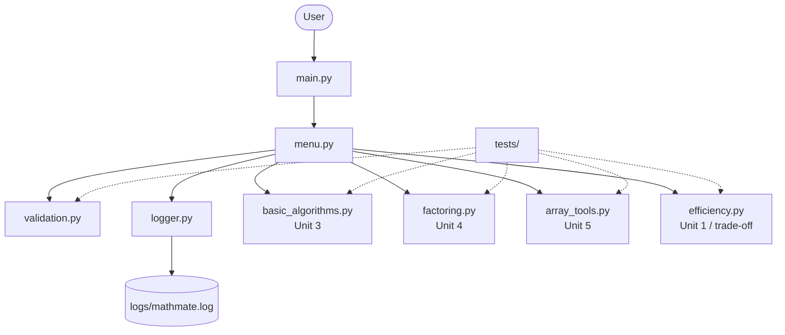
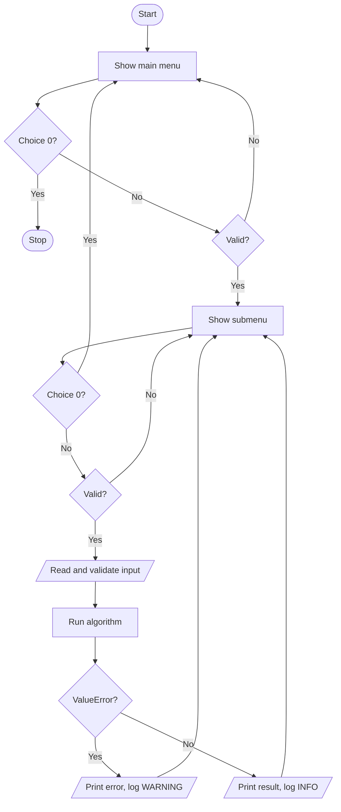
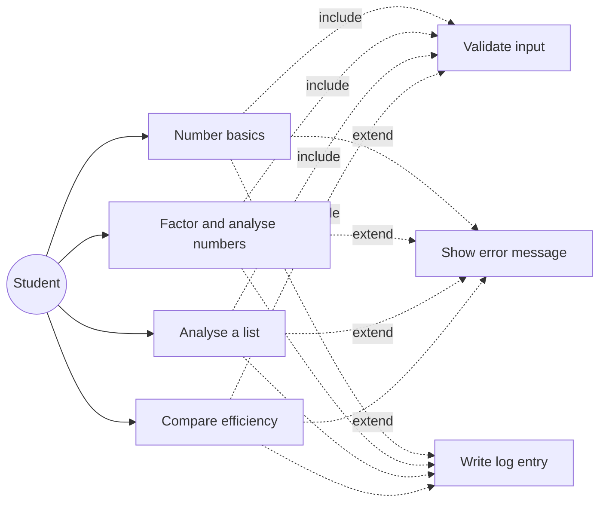
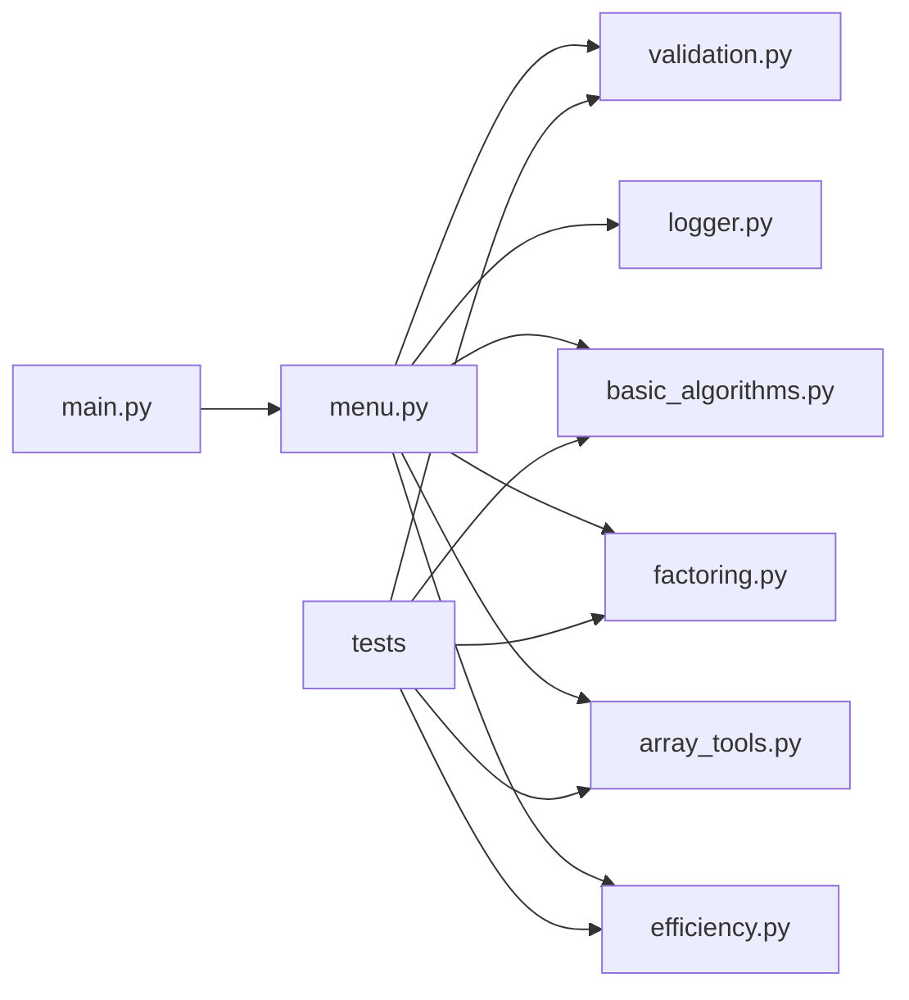
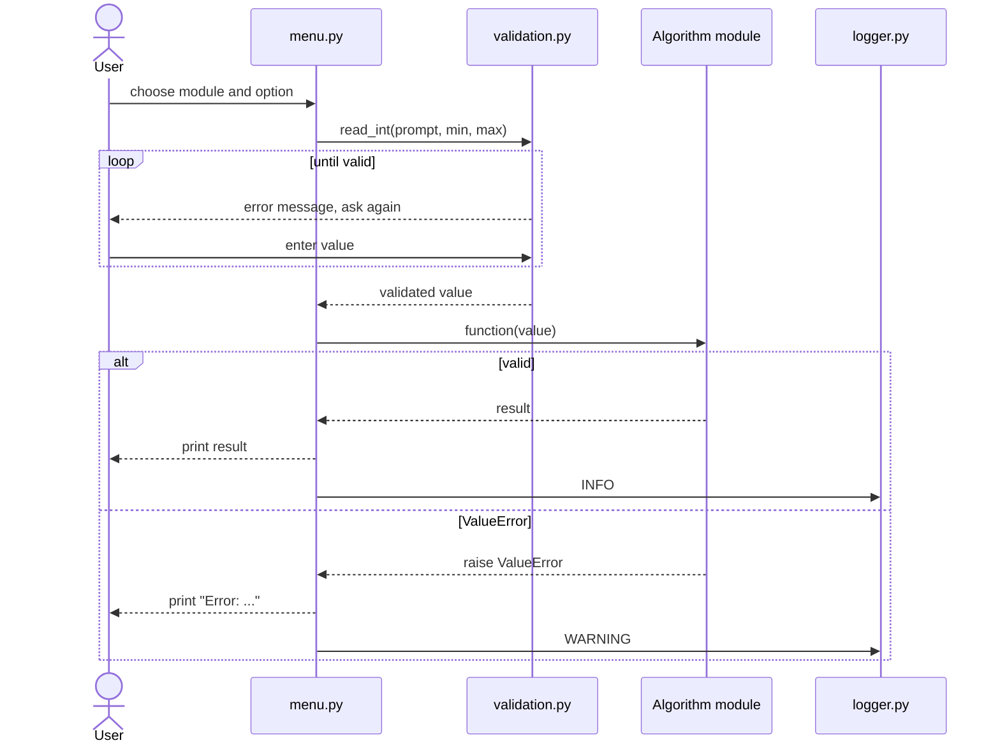

# Diagrams (Mermaid source)

GitHub renders these blocks automatically. PNG versions (Graphviz) are in `docs/diagrams/`.
Note: the Mermaid blocks below were written by hand and were not render-tested in the build environment;
the PNG files are the tested versions.

## System Architecture

## Workflow

## Use Case

## Component Diagram

## Sequence Diagram

## ER Diagram / Database Schema
Not applicable: MathMate has no database. The only storage is the plain-text log file
`logs/mathmate.log`, one line per event: `timestamp | LEVEL | message`.
